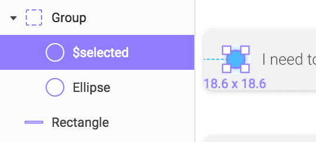
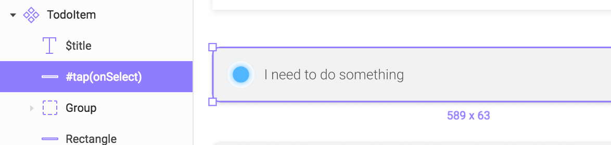
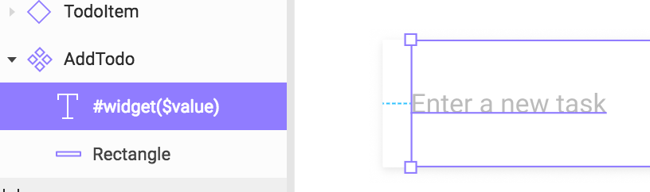

## Try it

**Disclaimer : All of this is purely experimental and under active development (read why I started the project [here](https://aloisdeniel.github.io/introducing-figma-to-flutter/)). If I would have access to Figma rendering source code it would have been a lot easier and quicker (if a Figma employee read this and can share the algorithm, it would be awesome!), but be aware that all the rendering logic is reverse engineered, so you will experience a lot of inconsistencies! Moreover a few performance and rendering tests have been yet, so please share your experiences through issues.** 

The easiest way is to use the [online tool](http://aloisdeniel.github.com/figma-to-flutter).

## Documentation

### Dynamic elements

**Example:** `$checkmark`

You can declare nodes as dynamic by starting name with `$`.

A `<WidgetName>Data` class is generated alonside the main class, with a property for each dynamic element.

Dynamic properties are exposed and depend on node type :

* `NODE`
    * `isVisible`: indicates whether the node and its children should be drawn.
* `TEXT`
    * `text` : the content of the text node. The style is the style of the first declared character.

### Directive

All directives start with `#` and allow you to control behavior of your components by pluging Flutter elements.

#### `tap` - `RECTANGLE` (experimental)

**Example:** `#tap(onSelected)`

Defines a rectangle as a tappable area (an [InkWell](https://docs.flutter.io/flutter/material/InkWell-class.html)) with a callback.

#### `widget` - `NODE` (experimental)

**Example:** `#widget(field)`

Includes a widget at the node location.

## Roadmap

- [ ] **Semantics** : adding semantics items for accessibility.
- [ ] **Drawing** : reproducing Figma drawing logic
    - [ ] Fills
        - [ ] `GRADIENT_ANGULAR`
        - [ ] `GRADIENT_DIAMOND`
        - [ ] `EMOJI`
        - [ ] `IMAGE`
            - [ ] Scale Modes
                - [ ] `FILL`
                - [ ] `FIT`
                - [ ] `TILE`
                - [ ] `STRETCH`
    - [ ] Effects
        - [ ] `INNER_SHADOW`
        - [ ] `LAYER_BLUR`
        - [ ] `BACKGROUND_BLUR`
    - [ ] Blend modes (*At the moment, all is considered* `PASS_THROUGH`/`NORMAL`)
    - [ ] Text rendering (*Basic text styling is providing but hasn't tested enough*)
    - [ ] Styles
- [ ] **Optimization** : reproducing the number of drawing operations
- [ ] **Widget includes** (*At the moment, widget location may be approximative and it is still experimental*)
- [ ] **Build time generator** : creating generators for updating widgets at build time (like `built_value`).
- [ ] **Unit tests** : create automated tests for validating rendering by comparing a Figma export to an app rendering.

## Features and bugs

Please file feature requests and bugs at the [issue tracker][tracker].

[tracker]: https://github.com/aloisdeniel/figma-to-flutter/issues