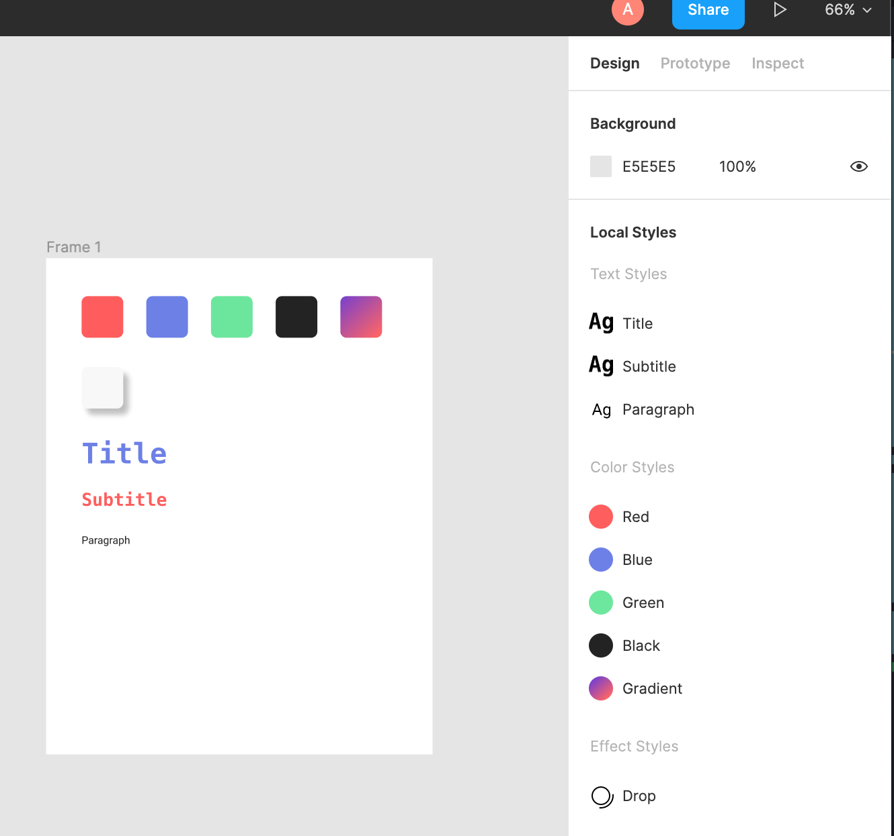
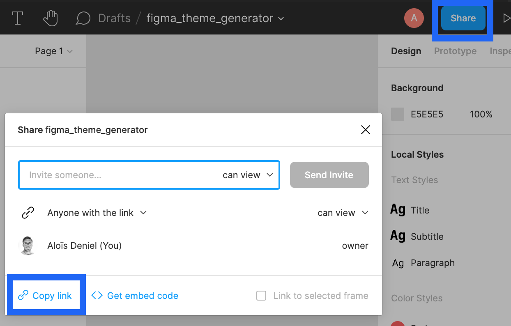
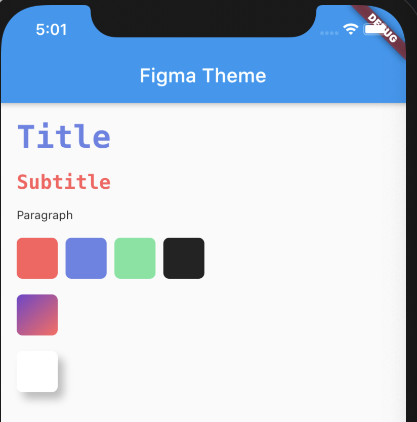

# figma_theme_generator

<p>
  <a href="https://pub.dartlang.org/packages/figma_theme_generator"></a>
  <a href="https://www.buymeacoffee.com/aloisdeniel">
    
  </a>
</p>


Generate a set of Flutter classes from the style library (colors, gradients, effects, text styles) of a Figma document.

## Install

To use [figma_theme_generator], you will need your typical [build_runner]/code-generator setup.\
First, install [build_runner] and [figma_theme] by adding them to your `pubspec.yaml` file:

```yaml
# pubspec.yaml
dependencies:
  figma_theme:

dev_dependencies:
  build_runner:
  figma_theme_generator:
```

This installs three packages:

- [build_runner](https://pub.dev/packages/build_runner), the tool to run code-generators
- [figma_theme](https://pub.dev/packages/figma_theme), a package containing annotations for [figma_theme_generator]
- [figma_theme_generator](https://pub.dev/packages/figma_theme_generator), the code generator.

## Usage

### Generation

First, you should have a Figma document that contains local styles.



You need two things to link the Figma document to your dart code :

1. **Figma API Token** : 
    1. Login to your `Figma account`.
    1. Head to the `Account Settings` from the top-left menu inside Figma.
    1. Find the `Personal Access Tokens` section.
    1. Click `Create new token`.
    1. A token will be generated. This will be your only chance to copy the token, so make sure you keep a copy of this in a secure place.
1. **File Key** : Extract it from the link of your document `Share` button in Figma.



> https://www.figma.com/file/**2n1EmQ6tqjbeydW2w2odZF**/figma_theme_generator?node-id=0%3A1

You then can define a class decorated with a `@FigmaTheme` annotation with the previous arguments.

You can for example define an `InheritedWidget` :

```dart
import 'package:example/credentials.dart';
import 'package:figma_theme/figma_theme.dart';
import 'package:flutter/widgets.dart';

part 'theme.g.dart';

@FigmaTheme(
  1,
  fileKey: '<file_key>',
  apiToken: '<api_token>',
)
class ExampleTheme extends InheritedWidget {
  final ExampleThemeData data;
  ExampleTheme({
    Key key,
    @required Widget child,
    @required this.data,
  }) : super(
          key: key,
          child: child,
        );

  static ExampleThemeData of(BuildContext context) {
    return context.dependOnInheritedWidgetOfExactType<ExampleTheme>()?.data ??
        ExampleThemeData.fallback();
  }

  @override
  bool updateShouldNotify(ExampleTheme oldWidget) {
    return oldWidget.data != data;
  }
}
```

To generate the `theme.g.dart` containing the `ExampleThemeData` data class, run the build runner command :

```bash
> flutter pub run build_runner build 
```

And now you're ready to use your theme!

```dart
ExampleTheme(
  data: ExampleThemeData.fallback(),
  child: MaterialApp(
      /// ...
  )
)
```

```dart
final exampleTheme = ExampleTheme.of(context);
```




## Regeneration

Because of the caching system of the build_runner, it can't detect if there is a change on the distant document and it can't know if a new generation is needed.

The first `version` parameter of the `@FigmaTheme` annotation solves this issue.

Each time you want to trigger a new generation, simply increment that version number and call the build runner again.
